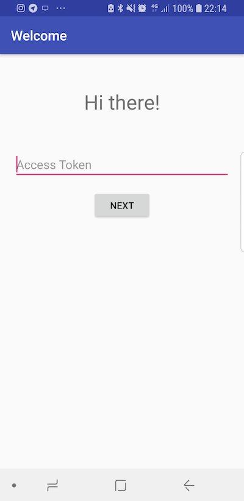
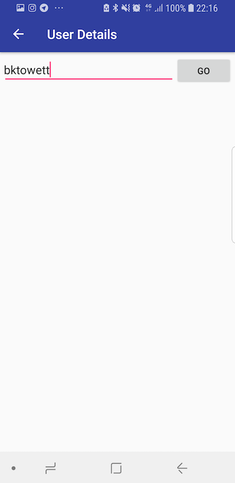
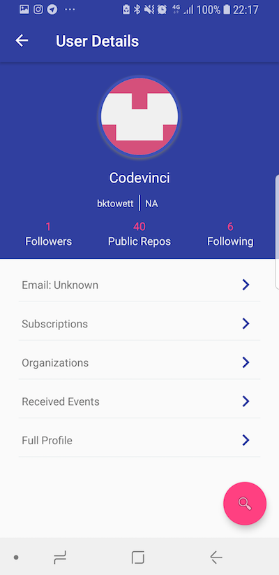

# Kotlin REST example(Github API with authorization)

Sample project on how to use retrofit 2 to consume REST APIs that require access token/authorization

## How it works
```
1. Input your access token
2. Input desired a valid github username
3. Makes a http call using the two params provided above
4. Return user detail
5. If you want to get another user's details. Simply press on the floating action button
```

## Screenshots




## Built With

* [Retrofit](https://github.com/square/retrofit) - HTTP Client
* [Maven](https://maven.apache.org/) - Dependency Management
* [Mockito](https://github.com/mockito/mockito) - Mocking Framework


## Acknowledgments

* [CircularImageVIew](https://github.com/lopspower/CircularImageView) - Circular image view 


